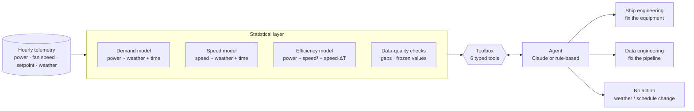

# hvac-anomaly-agent

[](https://github.com/OWNER/hvac-anomaly-agent/actions)
 

**An agent that answers the question operations teams care about: *which air handlers are wasting energy this week, why, and who should fix it?***

Large building fleets such as ships, campuses and hospitals run hundreds of air-handling units (AHUs). A threshold alarm on power draw fires constantly. It pages engineers for hot weather, for broken meters, and for spaces that are simply busier than they used to be. People learn to ignore it.

This project replaces that alarm with a two-layer system:

1. A **statistical layer** fits per-unit baselines and turns raw telemetry into a few auditable signals.
2. An **agent layer** follows an analyst's diagnostic workflow over those signals using tool calls. It decides the root cause, routes the issue to the right team, and writes the message they will read.



## Results

Results are averaged over 5 simulated fleets (3 ships × 40 AHUs, 6 weeks hourly, 15 injected faults per fleet, plus a heatwave and 3 legitimate schedule changes). Reproduce with `python -m hvac_agent eval`.

| | Naive threshold | Detector only | **Detector + agent** |
|---|---:|---:|---:|
| Precision | 0.20 | 0.83 | **0.99** |
| Recall | 0.56 | 0.96 | **0.96** |
| F1 | 0.29 | 0.89 | **0.97** |
| **False pages to ship crew per week** | 37.2 | 9.0 | **0.2** |
| Root-cause accuracy (detected faults) | n/a | n/a | 1.00 |
| Routed to the correct team | n/a | n/a | 1.00 |
| Onset date error | n/a | n/a | 0.6 days |

**How to read this**

* **Naive threshold** ("this week's mean power is above the training P95") is what most teams start with. A 4-day heatwave on one ship sets off all 40 of its units, so 80% of its pages are false. It also misses subtle faults.
* **Detector only** uses weather-adjusted baselines, so the heatwave no longer triggers it. It still pages the crew about broken meters and about spaces that changed schedule.
* **The agent's reasoning** removes those remaining false pages. Data faults go to data engineering, and a fan working harder *only at night while still following load* is recognised as a schedule change, not a fault.
* The remaining misses are faults that are genuinely too small to see in one week, such as a fouled coil that started degrading two days ago.

> **Caveat.** The simulator was written so that the root causes are separable in principle, so these numbers measure whether the pipeline and reasoning are correct, not how accurate it would be in the field. Real deployments face sensor drift, mixed faults and unlabelled history. See the roadmap. Detection thresholds were calibrated once on simulator seed 1 and frozen. Evaluation uses seeds 7, 11, 23, 42 and 99.

### Sample output (excerpt from [`results/report.md`](results/report.md))

> **9 units need attention from ship engineering.** Together they used about **4,893 kWh** more than expected last week (about $734 at $0.15/kWh).
>
> | Unit | Issue | Excess kWh (7d) | Since |
> |---|---|---|---|
> | S3-AHU018 | Fan running at full speed (possible manual override) | 1,492 | 2026-09-03 |
> | S3-AHU016 | Efficiency degrading (possible fouled coil or filter) | 351 | 2026-08-26 |
> | S2-AHU026 | Supply-air setpoint lowered | 196 | 2026-09-02 |
>
> **For data engineering**
> - **S3-AHU017** (power meter frozen, power value frozen for 168 h). Raise a ticket to verify the meter and connector.
>
> **Reviewed, no action**
> - S2-AHU032: excess 313 kWh (+13%); fan speed +24 pts at night vs +0 pts by day. Looks like the space is now in use overnight.

## The diagnostic workflow

Both agents get the same tools and the same five-step workflow an energy analyst would follow:

| Step | Question | Tool |
|---|---|---|
| 1. Triage | Which units are over their weather-adjusted baseline? | `get_fleet_overview` |
| 2. Data check | Can I trust this unit's numbers at all? | `check_data_quality` |
| 3. Model check | Is it this unit, or the whole ship / the weather? | `compare_to_ship_peers`, `get_weather_context` |
| 4. Diagnose | Which behaviour explains the excess energy? | `get_unit_diagnostics` |
| 5. Route | Equipment team, data team, or nobody? | `submit_diagnosis` |

The fault types are separated by a different pattern across three baselines:

| Root cause | Demand residual | Fan speed vs expected | Setpoint | Power for the same work |
|---|---|---|---|---|
| `control_override` | ↑↑ | ↑ day and night, pinned near max | n/a | normal |
| `setpoint_change` | ↑ | normal | ↓ 1.5–4 °C | normal |
| `efficiency_degradation` | ↑, growing | normal | n/a | ↑, trending up |
| `operational_change` *(not a fault)* | ↑ | ↑ **night only**, still follows load | n/a | normal |
| `sensor_fault` / `data_gap` | unreliable | n/a | n/a | frozen values / >20% missing |

### Design choices

* **The LLM never sees raw time series.** It reasons over compact numeric evidence from deterministic code. That makes it cheap, keeps every claim traceable, and limits hallucination. Its job is to submit evidence quoted from tool output.
* **The rule-based agent is a baseline, not a fallback.** It runs offline and deterministically in CI. Because it uses the same `Toolbox`, any Claude run can be scored against it with the same harness.
* **The cost of an alert is part of the metric.** "False crew pages" is reported directly, because that cost is what makes teams ignore alerts.
* **Typed outputs.** `submit_diagnosis` validates the root cause and route against enums, and every tool call is logged in `toolbox.calls` for audit.

## Quick start

```bash
pip install -e ".[dev]"
pytest -q                                  # 11 tests, including the Claude tool loop with a scripted client
python -m hvac_agent run                   # offline rule-based agent -> results/report.md
python -m hvac_agent eval                  # benchmark vs naive threshold and detector-only
```

With Claude:

```bash
pip install -e ".[llm]"
export ANTHROPIC_API_KEY=...               # optional: HVAC_AGENT_MODEL=<model id>
python -m hvac_agent run  --agent claude --ship S2
python -m hvac_agent eval --agent claude --seeds 7 11
```

## Repository layout

```
hvac_agent/
  simulate.py   fleet simulator: physics-lite AHUs, 5 fault types, heatwave, schedule changes, ground truth
  detect.py     per-unit demand / speed / efficiency baselines, CUSUM onset, data-quality checks
  tools.py      Toolbox (6 tools), JSON schemas, Diagnosis dataclass, audit log
  agent.py      RuleBasedAgent and ClaudeAgent (Anthropic Messages API tool-use loop)
  evaluate.py   detection P/R/F1, root-cause and routing accuracy, false crew pages, onset error
  report.py     markdown messages for ship and data teams
results/        committed benchmark output and sample report
```

## Roadmap

- [ ] Claude results table across model sizes, with cost per review
- [ ] Mixed faults (override plus fouling on one unit) and slow sensor drift
- [ ] Feedback loop: ship-team replies ("intentional change") update the unit's baseline
- [ ] Retrieval over maintenance logs to cite past fixes for the same unit
- [ ] Load real BMS exports through a `Telemetry` adapter

---
Built by Mahshad Shariatnasab. All data here is simulated. The project reflects patterns from several years of running fleet-scale HVAC anomaly detection in production, and contains no proprietary data or code.
